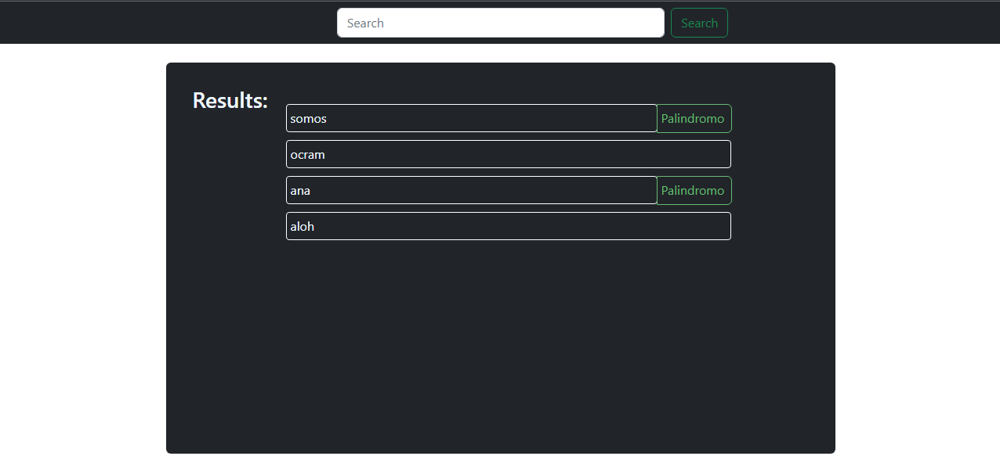

# Front Challenge CopyWrite

### Descripcion

Esta `APP` cuenta con un `Input` el cual ingresamos el texto o frase que queremos que invierta y nos dice, si ésta, es `palindroma` o no. la APP está Desarrollada en `React`, `Bootstrap`, `Sweetalert` para las alertas al usuario y `Redux` para manejar el estado y las peticiones a la API.

  

### Instrucciones

Para ejecutar cualquier comando debe posicionarse en la misma carpeta donde se encuentra el archivo `package.json`. 

* Correr la App: `npm run dev`
* Correr todos los tests: `npm test a`
* Correr un test en especifico: `npm test nombre-del-test` Ej: `npm test Home`  